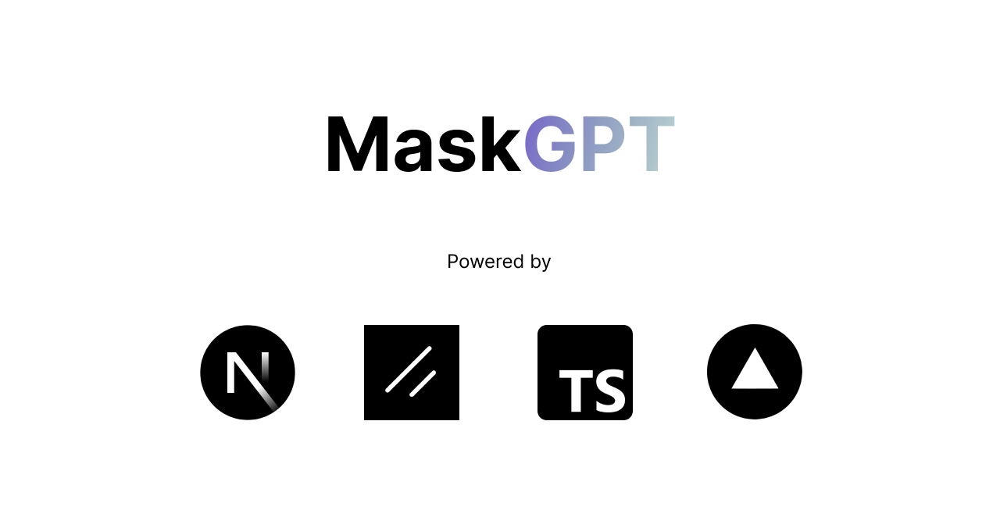
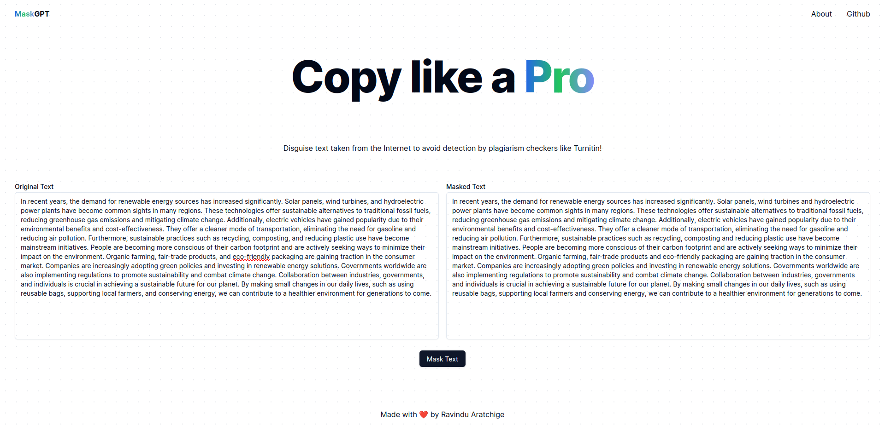

# MaskGPT - Copy like a Pro 🎭



MaskGPT is an online tool for camouflaging text copied from sources such as books, academia and the Internet, as well as AI-generated content, to avoid detection by plagiarism checkers and AI-content detection software like <a href="https://www.turnitin.com/">Turnitin</a>.

MaskGPT is built with NextJS, Vercel, Shadcn UI and TypeScript.

## Under the Hood

MaskGPT converts English letters in your plagiarised text into their <a href="https://en.wikipedia.org/wiki/Cyrillic_script">Cyrillic</a> counterparts. These Cyrillic counterparts are nearly identical to the respective English letters, and usually cannot be spotted by the human eye.

Additionally, it removes commas in your text if they appear before an <b>"and"</b> word, they will be removed. This is because text written by most mainstream LLMs usually contain commas before the word "and" in most instances, which can be a dead giveaway for AI-generated content.

For example,

`"Monday, Tuesday, Wednesday, and Thursday"` will be converted to `"Monday, Tuesday, Wednesday and Thursday"`

## Setup

Make sure you have <a href="https://nodejs.org/en">NodeJS</a> (at least v18.7.0) installed on your system.

Clone the repo to a desired location on your system:

```shell
git clone https://github.com/ravi-aratchige/maskgpt.git
```

Navigate into the cloned directory:

```shell
cd maskgpt
```

Install the necessary packages:

```shell
npm install
```

Launch a development server to view the project:

```shell
npm run dev
```

MaskGPT will open up in <a>`localhost:3000`</a>.


<em>MaskGPT in action</em>

## Contribution

This project is brand new, and all contributions are welcome via <a href="https://github.com/ravi-aratchige/maskgpt/pulls">pull requests</a>.

---

Made with ❤️ by Ravindu Aratchige. This project is licensed under the <a href="https://github.com/ravi-aratchige/maskgpt/blob/main/LICENSE">Apache License</a>.
